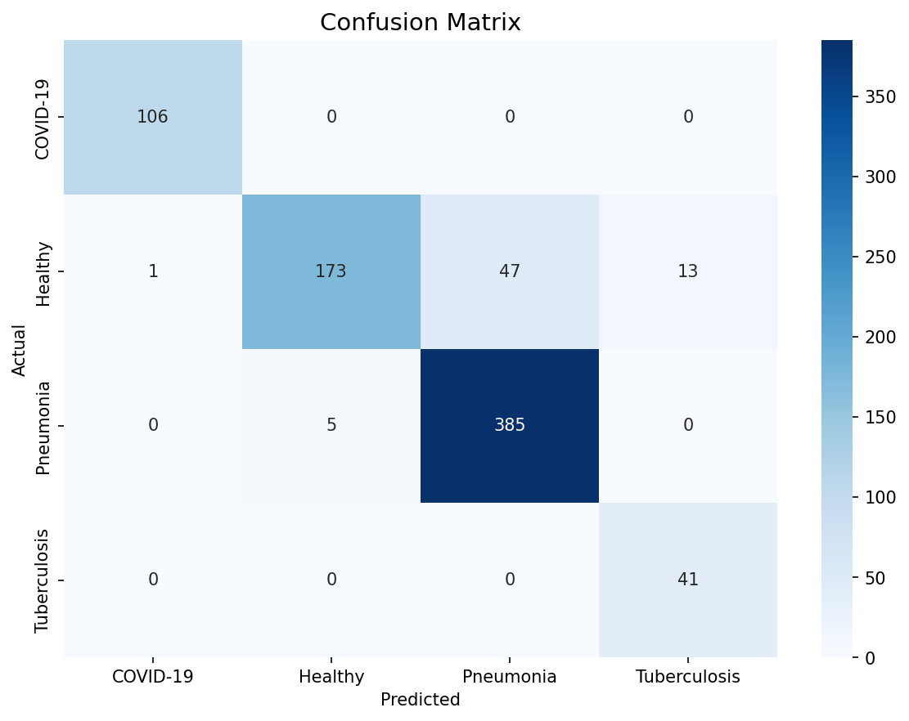
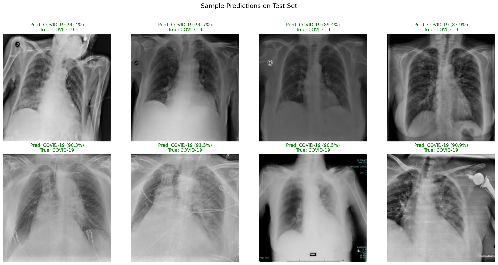
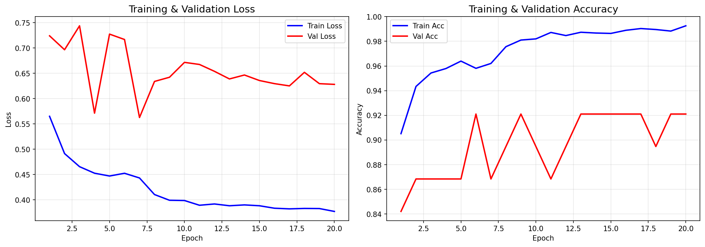

# ML Lung Detection

A machine learning project for automated detection and classification of lung diseases (COVID-19, Pneumonia, Tuberculosis, and Normal) from chest X-ray images. This project leverages deep learning to assist in rapid and accurate diagnosis, providing a web dashboard for predictions and model insights.

---

## Table of Contents
- [Project Overview](#project-overview)
- [Features](#features)
- [Project Structure](#project-structure)
- [Installation](#installation)
- [Usage](#usage)
- [Model Training](#model-training)
- [Web Dashboard](#web-dashboard)
- [Results & Visualizations](#results--visualizations)
- [License](#license)

---

## Project Overview
This project uses deep learning (PyTorch) to classify chest X-ray images into four categories:
- COVID-19
- Pneumonia
- Tuberculosis
- Normal

It includes scripts for data download, model training, and a Flask-based web dashboard for predictions and visualization.

---

## Features
- Automated data download and preprocessing
- Deep learning model training and evaluation
- Model performance reports (accuracy, confusion matrix, classification report)
- Web dashboard for uploading X-rays and viewing predictions
- Visualizations: confusion matrix, sample predictions, training history

---

## Project Structure
```
├── app.py                  # Flask web app
├── train.py                # Model training script
├── download_data.py        # Data download script
├── download_data_v2.py     # Alternative data download script
├── requirements.txt        # Python dependencies
├── Dockerfile              # Docker container setup
├── docker-compose.yml      # Docker Compose setup
├── static/                 # Static files (CSS, JS)
├── templates/              # HTML templates
├── data/                   # Data (excluded from repo)
├── output/                 # Model outputs (excluded from repo)
│   ├── chest_xray_model.pth
│   ├── classification_report.txt
│   ├── confusion_matrix.png
│   ├── sample_predictions.png
│   ├── training_history.json
│   ├── training_history.png
├── uploads/                # Uploaded images (excluded from repo)
├── medscan_history.db      # App database (excluded from repo)
└── .gitignore              # Git ignore rules
```

---

## Installation

1. **Clone the repository:**
   ```bash
   git clone https://github.com/yourusername/ml_lung_detection.git
   cd ml_lung_detection
   ```
2. **Install dependencies:**
   ```bash
   pip install -r requirements.txt
   ```
   Or use Docker:
   ```bash
   docker-compose up --build
   ```
3. **Download data:**
   ```bash
   python download_data.py
   # or
   python download_data_v2.py
   ```

---

## Usage

### Train the Model
```bash
python train.py
```
Model weights and reports will be saved in the `output/` directory.

### Run the Web Dashboard
```bash
python app.py
```
Visit `http://localhost:5000` in your browser.

---

## Web Dashboard
- Upload a chest X-ray image to get a prediction.
- View model performance metrics and visualizations.

---

## Results & Visualizations

### Confusion Matrix


### Sample Predictions


### Training History


#### Classification Report
See [output/classification_report.txt](output/classification_report.txt) for detailed metrics.

---

## License
This project is licensed under the MIT License. See the [LICENSE](LICENSE) file for details.

---

## Acknowledgements
- Datasets: [Specify sources if public]
- Libraries: PyTorch, Flask, etc.

---

## Contact
For questions or contributions, please open an issue or contact the maintainer at your.email@example.com.
